# Setup ngrok server và sử dụng colab như một remote server

## Table of Contents
* [About the Project](#1-about-the-project)
* [Getting Started](#2-getting-started)
    * [Prerequisites](#21-prerequisites)
* [The first option:Use service of ngrok](#3-the-first-option-use-service-of-ngrok)    
* [The second option: Build own ngrok server](#4-the-second-option-build-own-ngrok-server)
    * [Setup server](41-setup-server)
    * [Setup on Colab notebook](42-setup-on-colab-notebook)
* [Results](#5-results)
    * [Check hardware Colab](#51-check-hardware-colab)
    * [Training sample](#52-training-sample)
* [Tips & Tricks]()
    * [Code, auto upload, run, and debug source code with Pycharm Professional]()
* [Documents]()

## 1. About the Project

Trong qúa trình làm việc sử dụng Google colab, mình gặp một vấn đề rất khó chịu là Colab sử dụng Jupyter Notebook để làm 
việc. Một số vấn đề có thể kể đến là:

- **Code xấu:** Code cả project trong chỉ một notebook của colab thì nó xấu vch, chưa kể là cái gợi ý function của nó cũng
chậm làm giảm năng suất code, không phê được như Pycharm. Có thể khắc phục bằng cách là code ở local 
và push lên github sau đó clone về colab. Cách này code đẹp tí nhưng bắt tay vào làm thì hơi cực chứ không dễ.
  
- **Khó debug:** Bạn nào đã từng sử dụng Pycharm ở các máy local thì sẽ thấy n kỳ diệu thế nào.

- **Sử dụng terminal không linh hoạt:** Sử dụng terminal trong colab sida sau cái code xấu vừa chậm vừa khó nhìn. 
Mỗi lần muốn chạy một câu lệnh mới là xóa cell hiện tại đi hoặc phải tạo một cell mới
 
- **Phải lưu kết quả vào google drive:** Tốn dung lượng drive. Phức tạp khi code và sử dụng.
- **Khó theo dõi được Tensorboard**
- ......

Trong project này mình sẽ chia sẻ một cách làm việc hiệu quả với Google colab cho các bạn mới sử dụng colab. Một số chức năng được 
cung cấp:
- ssh vào colab và thao tác trên terminal với độ trễ thấp.
- Tự động download các kết quả(checkpoint, log,...) về local thay vì phải lưu vào 
drive.
- Theo dõi Tensorboard từ local browser, hoặc bất kỳ thiết bị nào truy cập được internet.
- Code và debug với Pycharm ở local và tự động đồng bộ code lên colab server.

## 2. Getting started
### 2.1 Prerequisites

Để thực hiện project này thì sẽ cần:
- Một server với IP tĩnh. Để demo mình sẽ sử dụng một máy ảo trên google cloud(Các bạn ra 
ngân hàng đăng ký một thẻ debit, dùng thẻ này để đăng ký sẽ được $300 free trong vòng một năm).
- Sử dụng linux terminal cơ bản.
- Máy tính để code. Laptop mình sử dụng có tuổi đời 7 năm, ram 4Gb.

## 3. The first option: Use service of ngrok

Cách này dễ làm nhưng độ trễ khi sử dụng các câu lệnh trên terminal lớn và bạn chỉ có thể mở ra một cổng để truy cập. 
Nên mình ít khi  sử dụng cách này. 

Bước 1: Truy cập vào trang https://ngrok.com , tạo acccount. Sau đó bạn sẽ có được một đoạn mã authtoken.

Bước 2: Tạo ra một file Colab notebook có nội dung giống của mình như [link](https://colab.research.google.com/drive/1s9aQsgg3IiWZom67Gdoue6flXeODpHz9?usp=sharing)

Bước 3: Config các tham số ở cell thứ 2 
```
import os
os.environ['authtoken'] = "1aDEELv5Yb24tBm509rGVDX7sDk_2oHnRo1bfpgiKSrRjnkcB"
os.environ['SSH_KEY'] = "ssh-rsa AAAAB3NzaC1yc2EAAAADAQABAAABAQDIykhpbjm/Yj3wZ55aMVyOy9DzKHdXh8ihs2SeQFzGKKsDcmCDyYb72g9nlA6gZVKFf00tD6TcMofoMu2O19IyhzM9/Ttnk32UXyVcwG83UJrU/lSh4PdFyminyNIJUQ4LAtpjOoObaLYYrYk1cPrq3qHV9prhKgZlmbsiMa/hDY4LFG6vgn6SdAWqlPRH8yvIVp6YdAH6LPR5z5JIL8pbQn71LeuJbJMsR50TYM3HvaTDZMim1Bcw0INGxp/hNJ523CHOI0iCLwqSFKd7HgxOq/tnf2rCyqcCKJH3yHkOATvgxoqAaFVhPp2WjWKX+BlV9Oq8Xzb3HzirEsE/HbT/ tanlm@pc11-All-Series-Invalid-entry-length-16-Fixed-up-to-11"
```
- authtoken: Token mà trang https://ngrok.com đưa cho bạn.
- SSH_KEY: ssh public key của máy local. 

Bước 4: Run toàn bộ file colab notebook. Ở cell cuối cùng ta sẽ thấy một câu lệnh ssh hiện ra

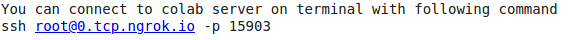

Copy câu lệnh này vào terminal thì ta có thể truy cập vào colab instance bằng SSH.

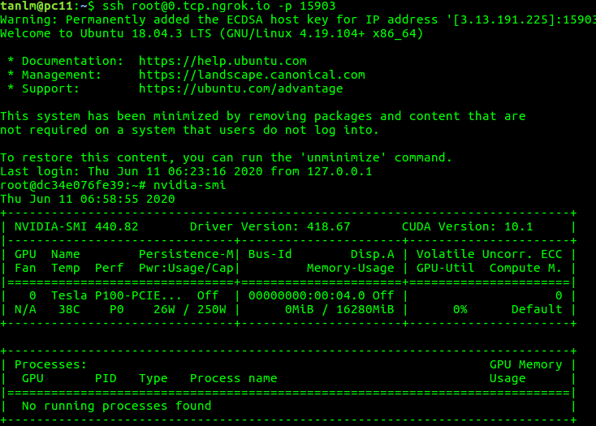

 
## 4. The second option: Build own ngrok server

Cách này sẽ hơi khó hơn chút là tự cài đặt ngrok server của riêng mình. 

Bù lại ta sẽ có thể sử dụng terminal một cách gần như real-time và mở nhiều cổng hơn để sử dụng.

Quá trình sẽ được chia thành 2 giai đoạn là setup server và setup client

### 4.1 Setup server
#### 4.1.1 Create an instance on  google cloud
Mình tạo ra một máy ảo *g1-small 1vCPU, 1.7 GB memory* ở khu vực Hongkong với giá khoảng  ~598 VNĐ/H. Quá rẻ cho một cuộc tình.

Hệ điều hành mình sử dụng ở đây là Ubuntu-16.04

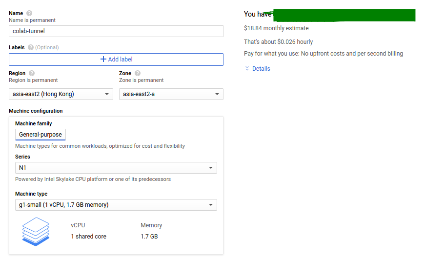
 
Tiếp đến là cấu hình mở port và cài đặt docker.
* Cấu hình server để mở các port: 7000, 8000, 8001, 4443, 10000-10050 để sử dụng. Gồm 2 bước: 
   * Mở port với google cloud. Các bạn google. [Đây](https://www.youtube.com/watch?v=JmjqPpQdtW8) là một ví dụ với mở cổng 8080 trên google cloud 
   * Mở port trên Ubuntu
     ```
     sudo ufw allow 7000
     sudo ufw allow 8000
     sudo ufw allow 8001
     sudo ufw allow 4443
     sudo ufw allow 10000:10050  
     ```
* Cài đặt docker. Đây là [hướng dẫn cài đặt](https://www.digitalocean.com/community/tutorials/how-to-install-and-use-docker-on-ubuntu-16-04) trên Ubuntu-16.04

#### 4.1.2 Build and run ngrok server:

Đầu tiên là clone code và các file cài đặt về:
```
git clone https://github.com/tanle2694/ssh_colab
```

Build docker và run ngrok server:
```
cd ssh_colab
chmod +x run_docker.sh
./run_docker.sh
```

Kiểm tra lại kết quả bằng câu lệnh 
```
docker ps
```
Nếu thành công thì kết quả sẽ hiện ra là có một docker đang chạy như hình bên 
dưới

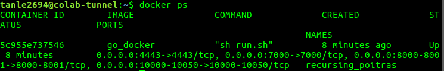

### 4.2 Setup on Colab notebook:

**Bước 1:** Tạo một file Colab notebook giống như trong file colab của mình trong [link](https://colab.research.google.com/drive/1Fmm5Ry_mjw69pUi_2y3wWJqzmaOROdvw?usp=sharing) 

**Bước 2:** Cấu hình các tham số trong Colab notebook

**Cell 1:**
```
%%writefile /tmp/ngrok-config
server_addr: colab.tunnel:4443
trust_host_root_certs: false
tunnels:
  ssh-app:
    remote_port: 10004
    proto:
      tcp: 22
  tensorboard-app:
    remote_port: 10006  
    proto:
      tcp: 6006    
```
Các bạn setup các thông số từ dòng tunnels trở xuống. Nếu không muốn thêm các cổng khác thì bạn giữ nguyên cell này.
 
Ở đây là mình setup 2 tunnel:
- *ssh-app:* dùng để map cổng 10004 trên ngrok server và cổng 22 trên máy Colab
- *tensorboard-app:* map cổng 10006 trên ngrok server và cổng 6006 trên máy Colab

Nếu các bạn muốn map các cổng khác thì có thể thêm vào bên dưới với format:
```
app-name:
  remote_port: xxx
  proto:
    tcp: yyy
```  

**Cell 2:**
```
function ClickConnect(){
  console.log("Working"); 
  document
    .querySelector("#top-toolbar > colab-connect-button")
    .shadowRoot
    .querySelector("#connect")
    .click()
}

setInterval(ClickConnect,60000)
```
Trong quá trình run Colab notebook, nếu không có thao tác gì với notebook thì session có thể bị mất kết nối.

Để giải quyết vấn đề này, đầu tiên hãy ấn phím F12, và copy nội dung trên vào console của trình duyệt như sau:
 
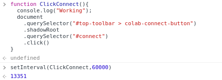

Sau 60s đoạn mã này sẽ tự động ấn nút *Connect* để tránh bị ngắt kết nối của session

**Cell 3:**
```
import os
os.environ['IP_SERVER'] = "35.186.148.224"
os.environ['SSH_KEY'] = "ssh-rsa AAAAB3NzaC1yc2EAAAADAQABAAABAQDGB10CfGiSci1JqI1LkwRUv13kGBlhf0zD2GRkKz6ixpzb3F9AN40tB7s+oqwqCoD6puB6B8e/RUnRbqTefNyMN3rhMzCzLK+nWZHqZF9D0HV/1ngxvu+R1SZjFdasJ52kRm1l8z6OAy+CHglYgG3a/qkzEOkfoMt3CKkNwCy6O6FxYi2Kzr12OfcPsySUByBlZv1G7TIEA4sl0IIYoPhgu5IM2gLXEQcvJZO6TGMgTV+yzh1/oZamQo/JB4SRYQERhe8bFCjqbEwACT3+H1pfTU0sWQbhcB/mLhZU9Ide7XV9Xr+3vp8VOyvVuV+5WjOcquaPLM6ieVaT90zBPweT tanlm@tanlm"
os.environ['APP_RUN'] = "ssh-app tensorboard-app"
os.environ['TAG'] = "v1.0"
```
- IP_SERVER: public IP của ngrok server chúng ta đã sử dụng
- SSH_KEY: ssh public-key của máy local
- APP_RUN: ở đây mình chạy 2 app đã đăng ký là *ssh-app* và *tensorboard-app*
- TAG: tag của code trên github. Phần này các bạn không cần sửa đổi

**Bước 3:** Run tất cả các cell
 
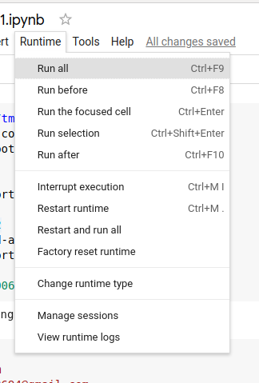

Khi run xong thì tại cell cuối cùng ta sẽ thấy câu lệnh ssh hiện ra.

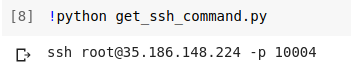

Copy câu lệnh trên vào terminal chúng ta sẽ truy cập vào được instance của Colab.

## 5. Results

### 5.1 Check hardware Colab:
Mình đang sử dụng Colab Pro. Ta hãy thử xem Colab Pro có gì:

- Check GPU với lệnh *nvidia-smi*, ta có GPU Tesla P100 16Gb VRAM
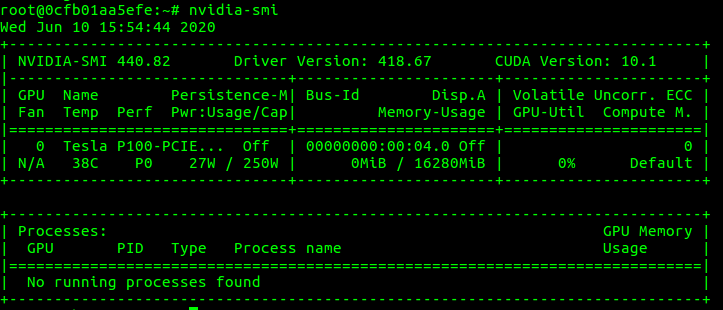

- Check CPU với lệnh *lscpu*, ta có 2 core CPU với xung nhịp 2.30GHz
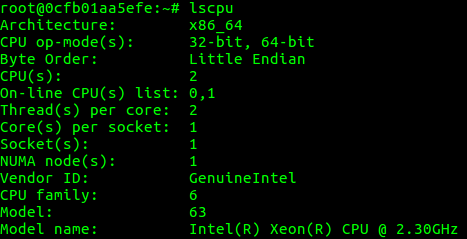
- Check RAM với lệnh *free -m*, ta có tổng cộng 13Gb Ram và còn có thể sử dụng 12Gb nữa
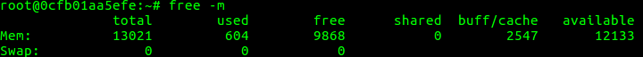


### 5.2 Training sample:
Trước khi training cần phải setup code và data. 
**Bước 1:** Clone code từ github xuống. Hoặc thay vì clone thì các bạn có thể upload trực tiếp từ local lên cũng được

`git clone https://github.com/tanle2694/mri_brain_segmentation`

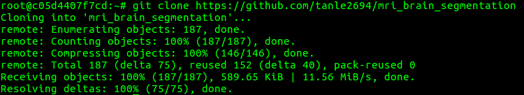

**Bước 2:** Upload data từ local lên. Sử dụng lệnh scp trỏ đến cổng 10004, để upload file *data_mri.zip* lên thư mục 
*/root/data* trên Colab

`scp -P 10004 data_mri.zip  root@35.186.148.224:/root/data`


**Bước 3:** Training và theo dõi kết quả.

Mình thường sử dụng [tmux](https://kipalog.com/posts/Nghich-tmux) để làm việc với các remote server.
Trong hình bên dưới là mình đang training ở panel bên trái và run Tensorboard ở pannel bên phải. 
  
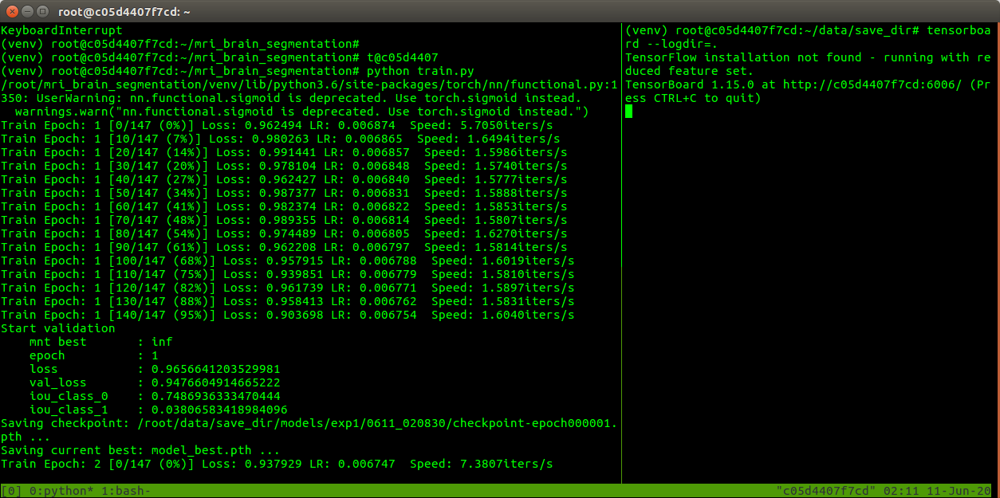

Ở local browser ta có thể theo dõi Tensorboard tại địa chỉ `http://35.186.148.224:10006`

Link này bao gồm địa chỉ của server cài đặt ngrok-server (35.186.148.224) và port 10006 là port đã setup cho 
Tensorboard-app

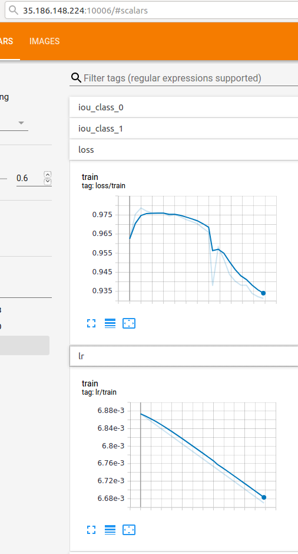


 **Bước 4:** Đồng bộ các checkpoint và log về local
 
Mình đã setup sẵn một file [bash-script](https://github.com/tanle2694/ssh_colab/blob/master/rsynfile.sh) cho phép đồng 
bộ một thư mục trên Colab server xuống local:

Các bạn chỉ cần setup các thông số:
```
REMOTE_IP="35.186.148.224"
REMOTE_PORT="10004"
REMOTE_DIR="/root/data/save_dir"
LOCAL_DIR="/home/tanlm/Downloads/lgg-mri-segmentation/remote_save_dir"
TIME_SLEEP=10
``` 
- REMOTE_IP: IP của ngrok-server
- REMOTE_PORT: port dùng để ssh
- REMOTE_DIR: Thư mục cần đồng bộ trên Colab server 
- LOCAL_DIR: Thư mục sẽ được đồng bộ xuống ở local
- TIME_SLEEP: Thời gian dừng giữa các lần đồng bộ file tính theo second

Sau khi setup các tham số xong thì chỉ cần chạy. Các checkpoint sẽ được đồng bộ xuống local mỗi 10 second:

```
chmod +x rsynfile.sh
./rsynfile.sh
```

## 5. Tips & Tricks:

### 5.1 Code, auto upload run, auto upload 
**UPDATING**

# 6. Documents: